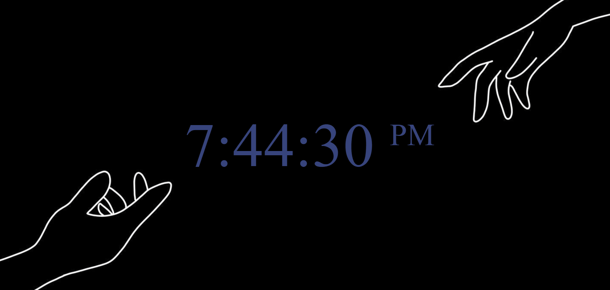

# Digital Clock 

## Description
Project aims to create a digital clock.

### Check The Live Website ➡️ [Live Website](https://digital-clock-mirayengin.vercel.app///)

### Animation of the Website

## Project Skeleton 

```
005-Digital-Clock(folder)
|
|----readme.md         
|----index.html  
|----index.css   
|----index.js
```
## Objective

Build a Digital Clock web site 

### At the end of the project, following topics are to be covered;

- HTML 

- CSS

- JS

- DOM Manipulation


### At the end of the project, students will be able to;